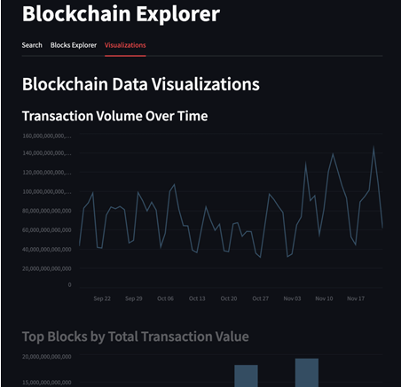
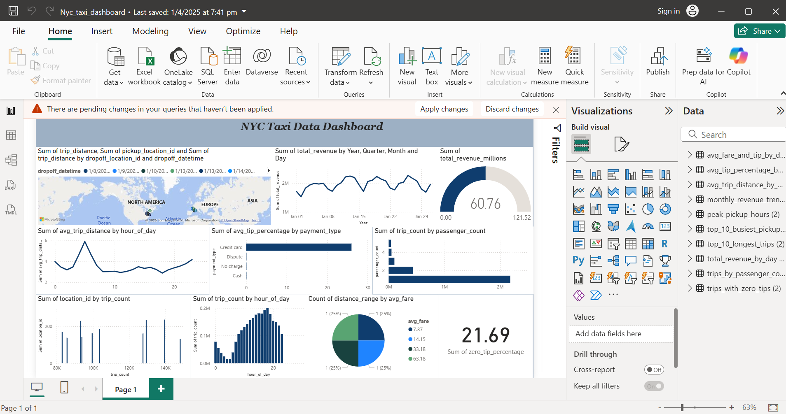
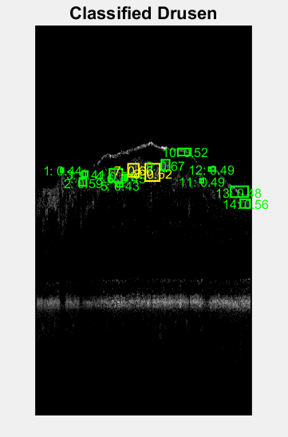

<!-- =========================== HEADER (keep above projects) =========================== -->

<!-- TOP HEADER: Cat + Name inline -->

  <table>
    <tr>
      <td align="center" width="120">
        
      </td>
      <td align="center" style="vertical-align: middle;">
        <h1 style="margin-bottom:6px;">☕ Gouri Menon 💜</h1>
        <h3 style="margin-top:0;">Data & ML Engineer · Cloud AI · Streamlit Enthusiast</h3>
      </td>
    </tr>
  </table>

<!-- PURPLE BANNER / WAVE -->

  

<!-- SECONDARY WAVE DIVIDER -->

  

<!-- INTRO LINE -->
<h2 align="center">hi, i’m <a href="https://github.com/gourimenon8">Gouri Menon</a> ☕</h2>

<em>ml engineer • cloud ai • streamlit enjoyer • café native</em>

<!-- TYPING TAGLINE -->

  

<!-- BADGE STRIP -->

  
  
  

---

### about me

- i love turning notebooks into **living apps** and **automated pipelines**  
- i’m currently exploring **gpu-accelerated training** (pytorch + cuda) and **serverless orchestration** (lambda/glue)  
- if i’m not coding, i’m probably in a cozy café sketching ui ideas on napkins 💜

---

### toolbox (purple edition)

  

---

### featured brews (projects)

<!-- CARD 1 -->
<table>
<tr>
<td width="35%">
  
</td>
<td>
  <h3>🚀 CryptoFlow 5m</h3>
  
real-time crypto portfolio optimizer retraining every 5 minutes with a live streamlit dashboard.

  <b>stack:</b> python · scipy · apscheduler · streamlit  
   
  <a href="https://github.com/gourimenon8/cryptoflow-5m">repo →</a>
</td>
</tr>
</table>

<!-- CARD 2 -->
<table>
<tr>
<td width="35%">
  
</td>
<td>
  <h3>📈 Citi Bike Forecasting (on Snowflake Snowpark)</h3>
  
feature-engineering + forecasting pipeline with tasks & streams, serving analytics directly from Snowflake.

  <b>stack:</b> snowflake · python · sql  
   
  <a href="https://github.com/gourimenon8/citibike-foreacasting">repo →</a>
</td>
</tr>
</table>

<!-- CARD 3 -->
<table>
<tr>
<td width="35%">
  
</td>
<td>
  <h3>⚡ Serverless ETL → Athena → Power BI</h3>
  
two AWS Lambda functions (ingest + filter) feeding Athena views into Power BI dashboards for dynamic visuals.

  <b>stack:</b> aws · athena · power bi  
   
  <a href="https://github.com/gourimenon8/aws-lambda-athena-powerbi-nyc-taxi">repo (coming soon) →</a>
</td>
</tr>
</table>

<!-- MINI SHOWCASE IMAGE -->

  
   
  <i>🩺 Retinal OCT Drusen Segmentation · Research prototype built in PyTorch (SAM + mask overlays)</i>

<!-- WAVE DIVIDER -->

  

  
  

<i>“somewhere between python scripts and espresso shots, i find my flow.”</i>

